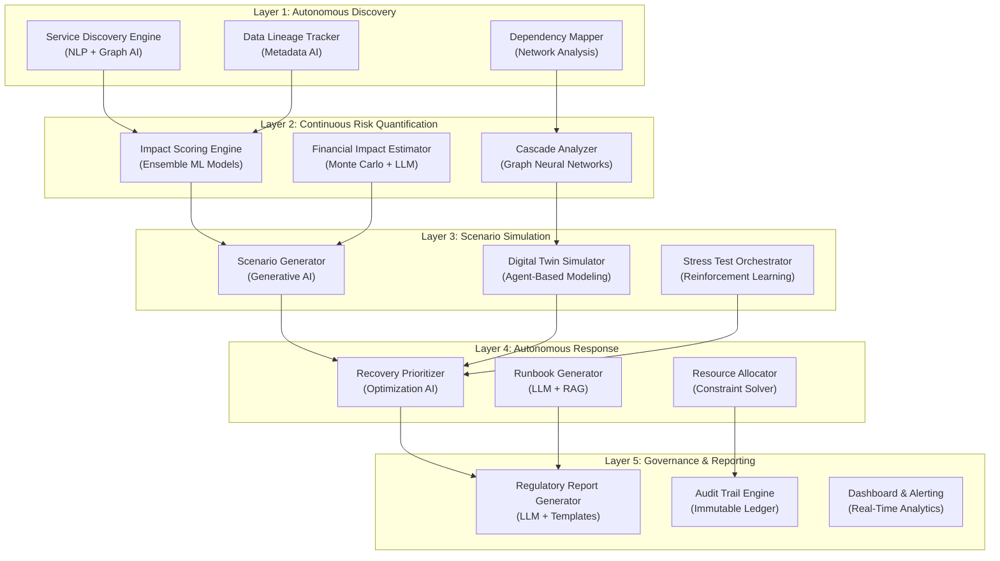
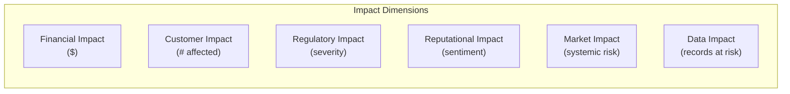
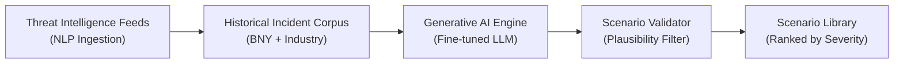
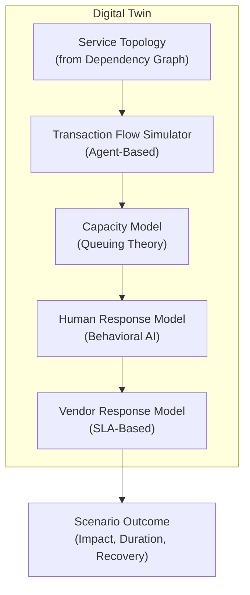
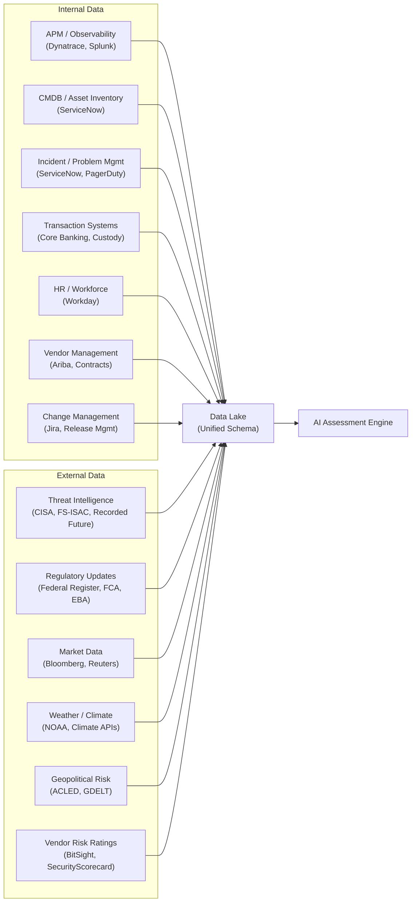
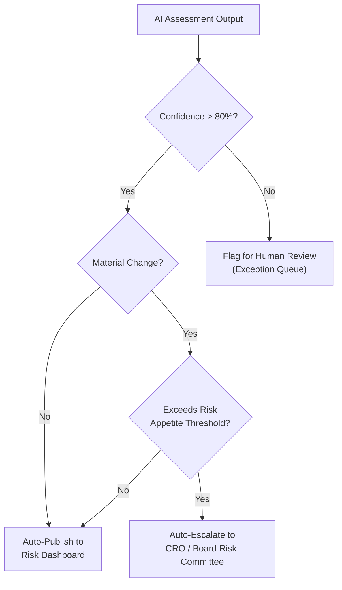
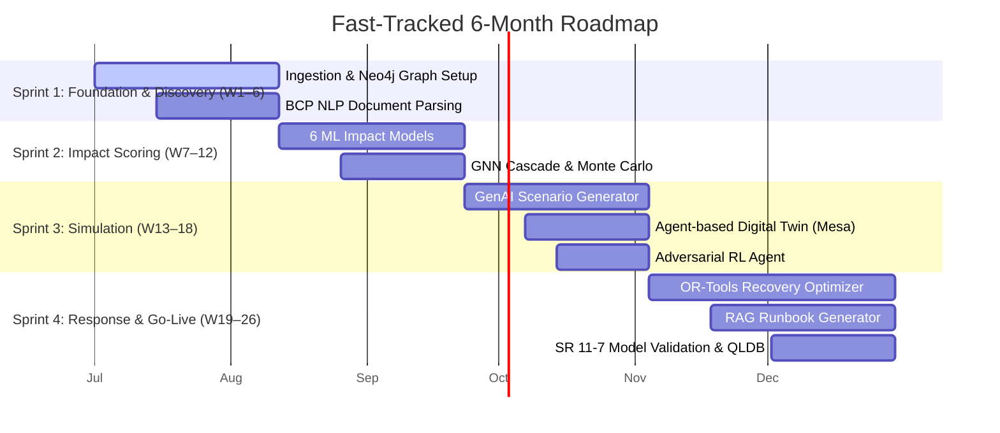

# AI-Driven Impact Assessment Framework for Operational Resilience & Business Continuity

## For a Global Systemically Important Bank (G-SIB) — BNY Mellon Archetype

---

## 1. Executive Summary

This document proposes a **fully autonomous, AI-driven Impact Assessment (IA) framework** that continuously evaluates operational resilience and business continuity posture for a custodian bank and asset servicer of BNY Mellon's scale (~$46 trillion in assets under custody, 35+ countries, 400+ legal entities). The framework eliminates the dependency on manual, periodic assessments by deploying a layered AI architecture that **discovers, quantifies, simulates, and remediates** operational risks in real-time — with zero human-in-the-loop for assessment execution.

> [!IMPORTANT]
> **Zero Human Intervention** means the AI system autonomously executes the assessment cycle. Humans retain governance oversight (approval of policy thresholds, regulatory submissions, and material risk acceptance) but do not perform assessment tasks.

---

## 2. Regulatory & Strategic Context

The framework is designed to satisfy and exceed the following regulatory mandates:

| Regulation | Jurisdiction | Key Requirement |
|---|---|---|
| **PRA SS1/21 & PS6/21** | UK | Define Important Business Services (IBS), set impact tolerances, map resources, test within tolerances |
| **DORA (EU 2022/2554)** | EU | ICT risk management, digital operational resilience testing, third-party risk, incident reporting |
| **OCC Heightened Standards** | US | Risk governance, concentration risk, operational risk management for large banks |
| **FFIEC BCP Handbook** | US | Business Impact Analysis (BIA), recovery strategies, testing |
| **Basel BCBS Principles** | Global | Operational resilience principles for banks, including change management and third-party dependency |
| **SEC Rule 18f-4 / 206(4)-9** | US | Operational resilience for asset management entities |

### BNY Mellon–Specific Considerations

- **Custodian & Clearing Infrastructure**: Disruption cascades to global capital markets
- **Multi-Entity Complexity**: 400+ legal entities requiring coordinated continuity
- **Settlement & Payment Criticality**: $2T+ daily in US government securities settlements
- **Interconnection Risk**: Counterparty/FMI dependencies (DTCC, Fedwire, SWIFT, CLS)

---

## 3. Framework Architecture



---

## 4. Layer 1 — Autonomous Discovery & Mapping

### 4.1 Important Business Service (IBS) Discovery

**Objective**: Automatically identify and classify all Important Business Services without manual cataloging.

#### AI Techniques

| Technique | Application | Data Sources |
|---|---|---|
| **NLP / Named Entity Recognition** | Extract service names, process descriptions, and ownership from unstructured documents | BCP plans, SOPs, audit reports, regulatory filings, board minutes |
| **Topic Modeling (BERTopic)** | Cluster related processes into coherent business services | Internal wikis, Jira/ServiceNow tickets, change requests |
| **Knowledge Graph Construction** | Build an ontology of services → processes → systems → people → vendors | CMDB, HR systems, vendor contracts, API catalogs |
| **Classification Models** | Auto-tag services as "Important" vs "Supporting" based on regulatory criteria | Historical BIA data, revenue data, customer impact data |

#### Auto-Classification Criteria (Weighted Scoring)

```
IBS_Score = w1·(Revenue_Impact) + w2·(Customer_Reach) + w3·(Regulatory_Criticality)
          + w4·(Market_Infrastructure_Dependency) + w5·(Substitutability_Inverse)
```

Where weights $w_1 \ldots w_5$ are learned from historical BIA outcomes and regulatory enforcement actions via gradient-boosted trees.

### 4.2 Dependency Mapping

**Objective**: Continuously map all internal, external, and cross-entity dependencies.

#### Four Dependency Dimensions

1. **Technology Dependencies**
   - Auto-discovered via: APM telemetry (Dynatrace/AppDynamics), API gateway logs, network flow data, Kubernetes service meshes
   - AI Model: Graph Convolutional Networks (GCN) to infer latent dependencies from co-failure patterns

2. **People Dependencies**
   - Auto-discovered via: HRIS data, access logs, communication patterns (email/Teams metadata — not content)
   - AI Model: Organizational Network Analysis (ONA) to identify single points of failure and key-person risk

3. **Third-Party Dependencies**
   - Auto-discovered via: Vendor contract NLP extraction, API call patterns, payment flows, SWIFT message analysis
   - AI Model: Supply chain risk scoring using Bayesian networks

4. **Data Dependencies**
   - Auto-discovered via: Data lineage tools (Apache Atlas, Collibra), ETL job metadata, database foreign key analysis
   - AI Model: Information flow analysis to identify critical data paths

#### Output: Living Dependency Graph

A continuously updated **directed acyclic graph (DAG)** stored in a graph database (Neo4j/Amazon Neptune):

```
Node Types: {Service, Application, Database, API, Vendor, Person, DataAsset, Location}
Edge Types: {depends_on, hosted_at, maintained_by, supplied_by, feeds_data_to, settles_via}
Edge Attributes: {criticality_score, latency_SLA, fallback_available, last_validated}
```

---

## 5. Layer 2 — Continuous Risk Quantification

### 5.1 Real-Time Impact Scoring Engine

**Objective**: Assign a dynamic, real-time impact score to every business service disruption scenario.

#### Multi-Dimensional Impact Model



Each dimension is scored by a specialized ML model:

| Dimension | Model | Input Features | Output |
|---|---|---|---|
| **Financial** | XGBoost Regressor | Revenue per service, transaction volume, penalty clauses, insurance coverage | $ loss per hour of disruption |
| **Customer** | Neural Network Classifier | Client AUM tiers, SLA terms, client concentration, service substitutability | # clients affected × severity tier |
| **Regulatory** | Fine-tuned LLM (Llama/GPT) | Regulatory text corpus, enforcement history, consent order patterns | Probability of enforcement action × expected fine |
| **Reputational** | Sentiment Analysis (FinBERT) | News feeds, social media, client complaint trends | Net Promoter Score delta prediction |
| **Market/Systemic** | Graph Neural Network | FMI interconnections, market share in service, settlement volume | Systemic risk contribution score (CoVaR-inspired) |
| **Data** | Classification Model | Data sensitivity labels, volume, PII/PCI indicators, cross-border flags | Records at risk × regulatory multiplier |

#### Composite Impact Score

$$
\text{Impact}_{total}(s, t) = \sum_{d \in D} \alpha_d \cdot f_d(s, t) \cdot g(\text{duration}(t))
$$

Where:
- $s$ = service, $t$ = time of disruption
- $D$ = \{Financial, Customer, Regulatory, Reputational, Market, Data\}
- $\alpha_d$ = dimension weight (calibrated to bank's risk appetite)
- $f_d(s,t)$ = dimension-specific impact function
- $g(\text{duration})$ = non-linear duration amplifier (impact accelerates over time)

### 5.2 Cascade Failure Analysis

**Objective**: Predict how a single-point failure propagates through the dependency graph.

#### Graph Neural Network (GNN) Approach

1. **Training Data**: Historical incident data (ServiceNow/PagerDuty), past BCP activations, and simulated cascades
2. **Model**: Message-Passing Neural Network (MPNN) over the dependency graph
3. **Output**: For each node $v$ in the graph, predict:
   - $P(\text{failure}|v_{\text{upstream}} \text{ failed})$ — conditional failure probability
   - $T(\text{propagation})$ — expected time to cascade arrival
   - $\text{Impact}_{cascade}$ — cumulative impact of the full failure chain

#### Cascade Criticality Index

$$
\text{CCI}(v) = \sum_{u \in \text{Downstream}(v)} P(\text{fail}_u | \text{fail}_v) \cdot \text{Impact}(u) \cdot e^{-\lambda \cdot d(v,u)}
$$

Where $d(v,u)$ is the graph distance and $\lambda$ is a decay parameter. Nodes with high CCI are **systemic chokepoints** requiring enhanced resilience.

### 5.3 Financial Impact Quantification

**Objective**: Produce auditable, dollar-denominated impact estimates.

#### Monte Carlo Simulation Engine

```
For each Important Business Service:
    For N = 100,000 iterations:
        1. Sample disruption_duration ~ LogNormal(μ_hist, σ_hist)
        2. Sample affected_scope ~ Categorical(full, partial, degraded)
        3. Sample time_of_day ~ Uniform(market_hours_weighted)
        4. Calculate:
           - Direct_Loss = f(revenue_rate, duration, scope)
           - Indirect_Loss = g(SLA_penalties, regulatory_fines, legal_costs)
           - Opportunity_Cost = h(client_attrition_model, AUM_at_risk)
           - Recovery_Cost = k(resource_rates, vendor_costs, overtime)
        5. Total_Loss = Direct + Indirect + Opportunity + Recovery
    Output: Loss distribution → VaR(95%), VaR(99%), Expected Shortfall
```

> [!NOTE]
> The Monte Carlo engine recalibrates daily using real transaction volumes, updated SLA terms, and current market conditions — no manual parameter tuning required.

---

## 6. Layer 3 — Scenario Simulation & Stress Testing

### 6.1 Generative Scenario Engine

**Objective**: Autonomously generate plausible, novel disruption scenarios — including scenarios the bank has never experienced.

#### Scenario Generation Pipeline



#### Scenario Categories (Auto-Generated)

| Category | Example Auto-Generated Scenario | Generation Method |
|---|---|---|
| **Cyber** | "Ransomware encrypts the securities settlement reconciliation database during month-end processing, with lateral movement to the DR site via compromised service account" | Adversarial scenario generation from MITRE ATT&CK + BNY's specific tech stack |
| **Third-Party** | "SWIFT network experiences a 14-hour outage coinciding with CLS settlement window, while backup SFTP channels are throttled by ISP congestion" | Compound event modeling from vendor SLA breach histories |
| **Technology** | "Core banking middleware (e.g., mainframe CICS region) suffers memory corruption causing silent data corruption in NAV calculations for 72 hours before detection" | Failure mode analysis from system architecture + FMEA patterns |
| **People** | "A flu pandemic causes 40% absenteeism in the Mumbai operations center during quarter-end, while travel restrictions prevent US staff redeployment" | Epidemiological modeling + geographic concentration analysis |
| **Geopolitical** | "Sanctions enforcement action freezes accounts at a key correspondent bank in Asia, requiring immediate re-routing of $800B in daily settlement flows" | Geopolitical risk NLP from news + sanctions database analysis |
| **Climate/Physical** | "Category 4 hurricane damages both the primary data center in NJ and floods the Manhattan headquarters, while the Texas DR site experiences concurrent power grid failure" | Climate model data + geographic correlation analysis |
| **Compound** | Any 2-3 of the above occurring simultaneously | Combinatorial scenario generation with correlation constraints |

#### Plausibility Filtering

Each generated scenario is scored by a **plausibility classifier** trained on:
- Historical banking incidents (OCC enforcement actions, FDIC failed bank reports)
- Near-miss events from the bank's own risk event database
- Published regulatory stress test scenarios (CCAR, DFAST)

Scenarios scoring below plausibility threshold are discarded. Remaining scenarios are ranked by **novelty × severity**.

### 6.2 Digital Twin Simulation

**Objective**: Run disruption scenarios against a virtual replica of the bank's operational environment.

#### Digital Twin Architecture



#### Agent-Based Modeling Components

1. **Transaction Agents**: Simulate real client transaction patterns (volumes, timing, types) based on historical data
2. **System Agents**: Model application behavior under stress (degradation curves, failover logic, queue buildup)
3. **Human Agents**: Model staff response times using organizational response patterns (shift schedules, escalation chains, decision latency)
4. **Vendor Agents**: Model third-party response based on contractual SLAs and historical performance

#### Simulation Outputs Per Scenario

| Output | Description |
|---|---|
| **Time-to-Impact** | How quickly the disruption reaches clients |
| **Blast Radius** | Number of services, clients, and entities affected |
| **Recovery Time Objective (RTO) Validation** | Whether actual recovery meets stated RTO |
| **Recovery Point Objective (RPO) Validation** | Data loss estimation vs. stated RPO |
| **Impact Tolerance Breach** | Whether the disruption exceeds PRA-defined impact tolerances |
| **Financial Loss Curve** | Cumulative $ loss over time |

### 6.3 Autonomous Stress Testing

**Objective**: Continuously stress-test resilience posture using reinforcement learning to find worst-case scenarios.

#### Adversarial RL Agent

A reinforcement learning agent is trained to **maximize disruption** (adversarial testing):

- **State**: Current operational posture (dependency graph, capacity utilization, staff levels, active incidents)
- **Actions**: Inject failures (disable a service, simulate vendor outage, corrupt data, reduce staff)
- **Reward**: Maximize impact score × cascade breadth × recovery time
- **Constraint**: Actions must be plausible (filtered by the plausibility classifier)

This produces a **worst-case scenario portfolio** — the most damaging plausible disruptions the bank could face.

---

## 7. Layer 4 — Autonomous Response & Recovery Planning

### 7.1 Recovery Prioritization Engine

**Objective**: Automatically determine the optimal recovery sequence when multiple services are disrupted.

#### Optimization Formulation

$$
\min_{x} \sum_{s \in S} \text{Impact}(s) \cdot T_{\text{recovery}}(s, x)
$$

Subject to:
- Resource constraints (staff, infrastructure, vendor capacity)
- Dependency ordering ($s_i$ cannot recover before its upstream dependencies)
- Regulatory constraints (certain services have mandated maximum tolerable downtime)

Solved using **mixed-integer linear programming (MILP)** with real-time constraint updates.

### 7.2 Automated Runbook Generation

**Objective**: Generate step-by-step recovery procedures without manual documentation.

#### RAG-Powered Runbook Engine

1. **Knowledge Base**: All existing runbooks, incident post-mortems, vendor support documentation, system architecture docs
2. **Generator**: LLM with Retrieval-Augmented Generation (RAG) produces context-specific recovery steps
3. **Validator**: Generated runbooks are validated against:
   - System configuration management database (CMDB) for accuracy
   - Historical incident resolution data for completeness
   - Regulatory requirements for compliance

#### Runbook Adaptation

Runbooks are **dynamically adapted** based on:
- Time of day (different staff available)
- Current system state (which components are healthy)
- Active incidents (avoid conflicting recovery actions)
- Geographic context (regulatory requirements vary by jurisdiction)

### 7.3 Resource Allocation Optimizer

**Objective**: Optimally allocate recovery resources across competing priorities.

Uses a **constraint satisfaction solver** considering:
- Staff skills matrix and availability
- Infrastructure capacity (DR sites, cloud burst capacity)
- Vendor support entitlements and response SLAs
- Budget constraints for emergency procurement

---

## 8. Layer 5 — Governance, Reporting & Audit

### 8.1 Automated Regulatory Reporting

| Report | Frequency | AI Generation Method |
|---|---|---|
| **PRA Self-Assessment** | Annual | LLM summarization of continuous assessment data against PS6/21 criteria |
| **DORA ICT Risk Report** | Quarterly | Automated extraction from risk scoring engine + incident database |
| **OCC Risk Assessment** | Annual | Template-filling from impact scores + scenario test results |
| **Board Risk Report** | Monthly | Executive summary generation with trend analysis and heat maps |
| **Regulatory Exam Packages** | On-demand | RAG-based document assembly from assessment evidence |

### 8.2 Immutable Audit Trail

Every AI decision is logged to an **append-only audit ledger** containing:

```json
{
  "timestamp": "2026-06-11T23:22:00Z",
  "assessment_id": "IA-2026-Q2-00847",
  "action": "impact_score_update",
  "service": "US_Government_Securities_Settlement",
  "previous_score": 94.2,
  "new_score": 96.7,
  "reason": "Increased transaction volume detected (+12% MoM) combined with reduced DR site capacity (planned maintenance)",
  "model_version": "impact_scorer_v3.2.1",
  "input_features_hash": "sha256:a1b2c3...",
  "confidence": 0.94,
  "data_sources": ["APM_telemetry", "transaction_volume_feed", "DR_capacity_monitor"],
  "regulatory_classification": "material_change"
}
```

### 8.3 Explainability Layer

Every impact score includes a **natural-language explanation** generated by an interpretable AI pipeline:

```
Impact Score: 96.7 / 100 (CRITICAL)

Contributing Factors:
1. [42%] Financial: This service processes $2.1T daily in government securities 
   settlements. A 4-hour outage during peak hours would result in estimated 
   direct losses of $47M–$112M (95% CI) from failed settlements and penalties.

2. [28%] Systemic: 847 downstream counterparties depend on this service. 
   Cascade analysis shows 94% probability of triggering DTCC contingency 
   procedures within 2 hours of failure.

3. [18%] Regulatory: OCC has issued 3 MRAs related to this service's 
   resilience in the past 24 months. Probability of enforcement action 
   given disruption: 0.73.

4. [12%] Reputational: Sentiment model predicts 15-point NPS decline among 
   top-tier institutional clients within 30 days of a publicized outage.

Change Driver: Transaction volume increase of 12% MoM has pushed service 
utilization to 87% of peak capacity, reducing headroom for graceful degradation.
```

---

## 9. Data Architecture

### 9.1 Data Ingestion Streams



### 9.2 Data Refresh Cadence

| Data Type | Refresh Frequency | Staleness Tolerance |
|---|---|---|
| System telemetry / APM | Real-time (streaming) | < 1 minute |
| Transaction volumes | Every 15 minutes | < 30 minutes |
| Incident data | Real-time (event-driven) | < 5 minutes |
| CMDB / asset inventory | Daily | < 24 hours |
| HR / workforce data | Daily | < 24 hours |
| Vendor risk scores | Weekly | < 7 days |
| Threat intelligence | Hourly | < 2 hours |
| Regulatory updates | Daily | < 24 hours |
| Climate / weather | Every 6 hours | < 12 hours |

---

## 10. Model Governance & Trust

### 10.1 Model Risk Management (SR 11-7 Compliance)

Since this framework deploys AI models for risk-critical decisions, it must comply with the **Federal Reserve's SR 11-7** guidance on model risk management:

| SR 11-7 Requirement | Framework Implementation |
|---|---|
| **Model Inventory** | All models registered in a central model registry with version control |
| **Independent Validation** | Challenger models run in parallel; automated comparison of outputs |
| **Ongoing Monitoring** | Concept drift detection using PSI/KS statistics on input distributions |
| **Documentation** | Auto-generated model cards for every deployed model |
| **Limitations** | Each model's known limitations encoded as operational constraints |

### 10.2 Bias & Fairness

- Impact scores are audited for **geographic bias** (e.g., systematically undervaluing non-US operations)
- **Scenario generation** is tested for **recency bias** (over-weighting recent event types)
- **Calibration testing**: Predicted impacts are compared against actual incident outcomes quarterly

### 10.3 Fallback & Override Mechanisms



> [!WARNING]
> While the framework operates without human intervention for assessment execution, **risk acceptance decisions** that exceed predefined thresholds still require human authorization per regulatory requirements. The AI system escalates these automatically.

---

## 11. Implementation Roadmap



---

## 12. Key Performance Indicators (KPIs)

| KPI | Current State (Manual) | Target State (AI) | Improvement |
|---|---|---|---|
| **Assessment Frequency** | Annual / Semi-Annual | Continuous (real-time) | ∞ |
| **Time to Complete Full BIA** | 8–12 weeks | < 24 hours (initial), continuous thereafter | 98%+ reduction |
| **Scenario Coverage** | 15–30 predefined scenarios | 10,000+ generated scenarios/quarter | 300x+ |
| **Dependency Map Accuracy** | ~60% (self-reported) | >95% (auto-discovered + validated) | +35pp |
| **Time to Detect Impact Change** | Weeks to months | Minutes | 99%+ reduction |
| **Recovery Prioritization Time** | Hours (war room decisions) | Seconds (automated optimization) | 99.9%+ reduction |
| **Regulatory Report Preparation** | 4–6 weeks | < 48 hours (auto-generated) | 95%+ reduction |
| **False Positive Rate** | N/A (manual = no scoring) | < 5% (calibrated quarterly) | — |

---

## 13. Risk & Limitations

> [!CAUTION]
> ### Known Limitations
> 1. **Black Swan Events**: AI models trained on historical data may underestimate truly unprecedented scenarios. Mitigation: Adversarial RL agent + expert red-team reviews annually.
> 2. **Data Quality Dependency**: Garbage in = garbage out. The framework requires clean, complete CMDB and telemetry data. Mitigation: Automated data quality scoring with minimum thresholds.
> 3. **Model Hallucination**: LLM-generated scenarios or runbooks may contain plausible-sounding but incorrect information. Mitigation: Grounding via RAG + automated validation against CMDB.
> 4. **Regulatory Acceptance**: Regulators may not initially accept fully AI-generated assessments. Mitigation: Parallel run with manual process during Phase 5; extensive explainability.
> 5. **Adversarial Attack Surface**: The AI system itself becomes a high-value target. Mitigation: Air-gapped model serving, input validation, adversarial robustness testing.

---

## 14. Technology Stack Recommendation

| Component | Recommended Technology | Rationale |
|---|---|---|
| **Graph Database** | Neo4j / Amazon Neptune | Native graph queries for dependency analysis |
| **ML Platform** | Vertex AI / SageMaker | Managed model training, serving, and monitoring |
| **LLM** | Fine-tuned Llama 3 / GPT-4 (Azure) | Scenario generation, report writing, runbook generation |
| **Streaming** | Apache Kafka / Confluent | Real-time telemetry and event ingestion |
| **Simulation** | Mesa (Python) / AnyLogic | Agent-based modeling for digital twin |
| **Optimization** | Google OR-Tools / Gurobi | MILP for recovery prioritization |
| **Observability** | Dynatrace / Datadog | APM and infrastructure monitoring |
| **Data Lake** | Databricks / Snowflake | Unified analytics platform |
| **Orchestration** | Apache Airflow / Prefect | ML pipeline orchestration |
| **Audit Ledger** | Amazon QLDB / Hyperledger | Immutable assessment audit trail |
| **Visualization** | Grafana / Tableau | Real-time dashboards and reporting |

---

## 15. Conclusion

This framework transforms operational resilience impact assessment from a **periodic, manual, backward-looking exercise** into a **continuous, autonomous, forward-looking capability**. By layering discovery, quantification, simulation, and response AI systems, a bank like BNY Mellon can:

1. **Know its risk posture in real-time** — not once a year
2. **Anticipate failures before they happen** — not just react to them
3. **Quantify impact in dollars, not adjectives** — enabling true risk-based decision-making
4. **Satisfy regulators proactively** — with continuous evidence, not periodic scrambles
5. **Discover unknown-unknowns** — through adversarial AI scenario generation

The result is a resilience posture that is not just compliant, but genuinely **antifragile** — a system that gets stronger with every disruption it detects, simulates, and learns from.
