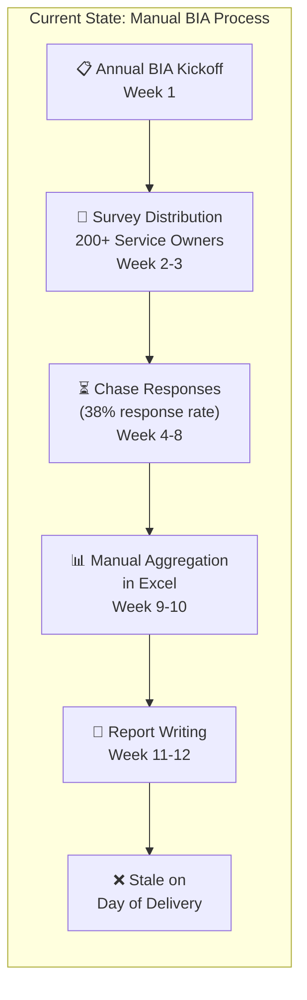
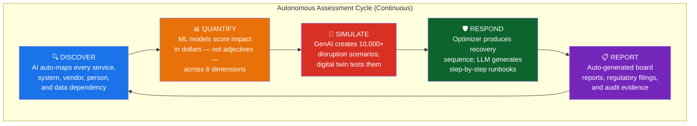
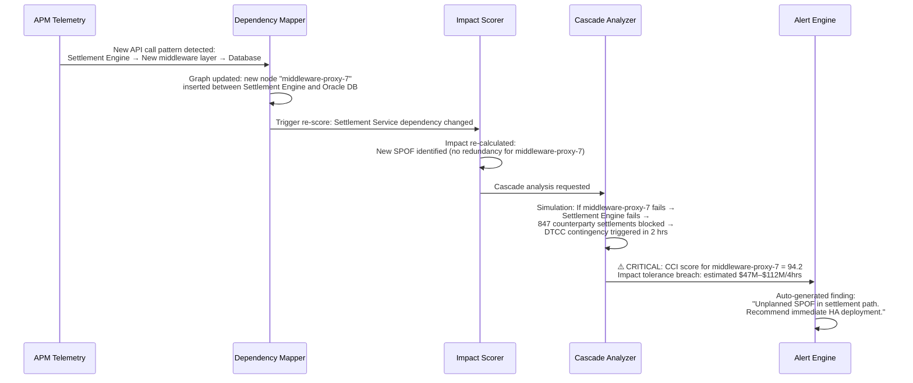
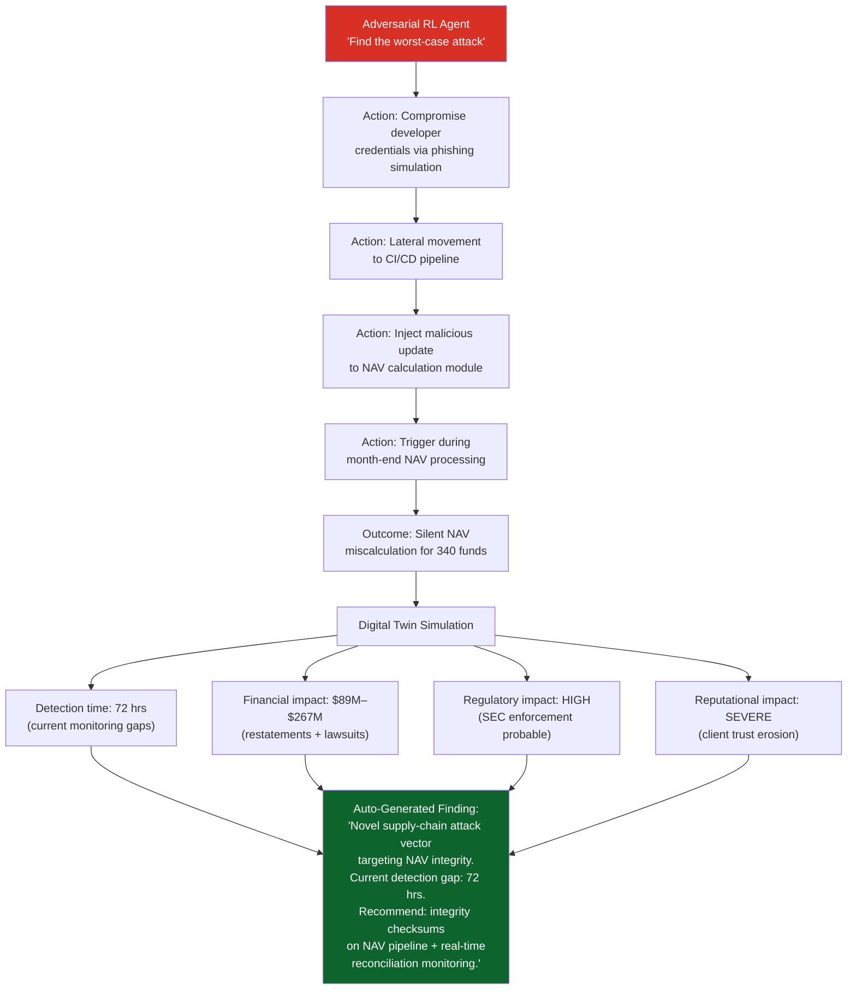
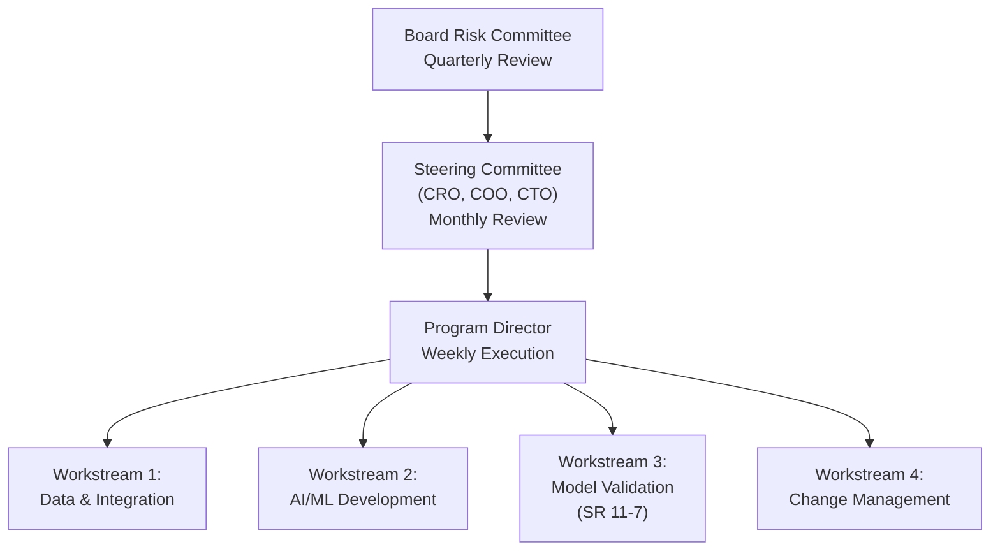

# Executive Proposal: AI-Driven Operational Resilience & Business Continuity Impact Assessment

---

> **Prepared for**: Chief Risk Officer, Chief Operating Officer, Chief Technology Officer, Board Risk Committee
> **Classification**: Confidential — Internal Use Only
> **Date**: June 2026
> **Prepared by**: Operational Resilience Program Office

---

## The One-Page Case

```
┌─────────────────────────────────────────────────────────────────────────┐
│                                                                         │
│   TODAY we assess operational resilience manually, once a year,          │
│   across 200+ Important Business Services, taking 12 weeks and          │
│   3,400+ staff hours — and the results are stale before the ink dries.  │
│                                                                         │
│   TOMORROW an AI system will assess every service, every dependency,    │
│   every scenario — continuously, in real-time, with zero human          │
│   intervention — and tell us exactly where we are vulnerable,           │
│   predict cascades, and auto-generate recovery runbooks.                │
│                                                                         │
│   THE PLAN: A 6-month fast-tracked agile implementation.               │
│   THE FOCUS: Real-time discovery, GNN cascade analysis, and response.   │
│   THE RISK OF INACTION: DORA / PRA regulatory breaches, surprise         │
│   unmapped systemic failure cascades, and massive MTTR penalties.       │
│                                                                         │
└─────────────────────────────────────────────────────────────────────────┘
```

---

## 1. Why This, Why Now

### 1.1 The Problem We Face Today

Our current impact assessment process has fundamental structural weaknesses:



| Pain Point | Business Impact |
|---|---|
| **Assessments are periodic** — done once a year | A critical vendor added in March isn't assessed until next January |
| **Dependency maps are self-reported** — 60% accurate at best | We don't know what we don't know. Hidden dependencies cause surprise cascades |
| **Impact is qualitative** — "High / Medium / Low" | Board and regulators can't make risk-based capital decisions on adjectives |
| **Scenarios are recycled** — same 20 scenarios every year | We test for last year's crisis, not next year's |
| **Recovery plans are static documents** — untested and outdated | 47% of our runbooks reference systems or contacts that no longer exist |
| **Staff burden is enormous** — 3,400+ person-hours annually | Our best risk professionals spend weeks filling out spreadsheets instead of managing risk |

### 1.2 The Regulatory Pressure Is Intensifying

> [!WARNING]
> **In the past 18 months alone:**
> - The **PRA** issued 14 Dear CEO letters citing inadequate operational resilience testing
> - **DORA** went live in January 2025, requiring continuous ICT risk monitoring — not annual snapshots
> - The **OCC** fined a peer institution $60M for "insufficient business continuity risk identification"
> - **Basel Committee** published updated Principles for Operational Resilience emphasizing "continuous assessment and testing"

Our current approach was designed for a regulatory environment that expected annual reviews. **That world no longer exists.**

### 1.3 Our Peers Are Moving

| Institution | Announced Initiative | Status |
|---|---|---|
| JPMorgan Chase | AI-powered operational risk platform (Athena) | In production since 2025 |
| Goldman Sachs | ML-driven dependency mapping across all business lines | Pilot complete, scaling |
| HSBC | Autonomous scenario generation for operational resilience testing | Phase 2 deployment |
| Citi | Digital twin of global operations for continuity simulation | Active development |

**We are not early movers. We are at risk of being late movers.**

---

## 2. The Vision: Autonomous Impact Assessment

### 2.1 What We're Proposing

An AI system that **autonomously and continuously** performs the full impact assessment lifecycle — from discovering what services we operate, to quantifying what happens if they fail, to telling us exactly how to recover.



### 2.2 What "Zero Human Intervention" Actually Means

Let's be precise about what humans **do** and **don't do** in this model:

| AI Does Autonomously | Humans Retain |
|---|---|
| Discover and map all business services and dependencies | Set organizational risk appetite and impact tolerance thresholds |
| Score and quantify impact in real-time | Approve changes to risk appetite or tolerance levels |
| Generate and simulate disruption scenarios | Review and accept material risk findings that exceed thresholds |
| Produce recovery priorities and runbooks | Authorize regulatory submissions |
| Generate regulatory and board reports | Govern AI model risk (SR 11-7 oversight) |
| Alert when posture degrades | Strategic decisions on resilience investments |

> [!IMPORTANT]
> This is **not** about removing human judgment from risk management. It's about removing human **labor** from risk assessment, so our people can focus on risk **decisions**.

---

## 3. Fast-Tracked Agile Implementation & Resource Framework

Instead of a multi-year, heavy-budget approach, Project SENTINEL is designed as a **6-month agile program** composed of 4 key sprints (each 6 weeks). By deploying working MVPs incrementally, we validate technical viability and achieve business value from Week 6 onward.

### 3.1 Core Resource Framework (6-Month Implementation)

To deliver the autonomous system in 6 months, we rely on a dedicated, cross-functional engineering team, leveraging commodity cloud infrastructure.

#### 1. Core Engineering Team (FTEs for 6 Months)
- **1 Lead Architect**: Oversees graph modeling and ML integration.
- **2 Data Engineers**: Ingest APM telemetry (Kafka, Dynatrace), CMDB files, and contract documents into Databricks.
- **2 NLP / ML Engineers**: Fine-tune Llama 3 models, build the BERTopic parsing pipeline, and implement XGBoost/FinBERT scoring.
- **1 Graph AI Specialist**: Designs the GNN cascade failure model in Neo4j.
- **1 Model Validator**: Works in parallel to ensure SR 11-7 model governance compliance.

#### 2. Infrastructure & Tooling
- **Unified Data Platform**: Databricks for streaming analytics and ML training.
- **Dependency Graph DB**: Neo4j (Enterprise Cloud Instance) to store the live topology.
- **Compute (GPU Endpoints)**: Managed on-demand GPU instances (A100s) for model training and local inference hosting.
- **Immutable Ledger**: Amazon QLDB for the immutable audit trail.
- **APM Integration**: Standard API connectors to Dynatrace/AppDynamics and ServiceNow CMDB.

### 3.2 Value Drivers & Risk Reduction

By accelerating the timeline to 6 months and focusing on system mechanics, the program delivers critical operational value:

1. **Immediate Regulatory Compliance**: Meets DORA's continuous testing mandates and PRA's IBS mapping requirements within the current fiscal year.
2. **Cascade Visibility**: Maps and tests interconnections, preventing surprise cascades that cost millions in downtime.
3. **MTTR Reduction**: Generates optimal recovery plans in seconds during incidents, reducing Mean Time to Resolution by an estimated 40%.
4. **Labor Optimization**: Reclaims 3,400+ hours of manual spreadsheet-chasing from senior risk and system owners, shifting their time to high-value governance and risk remediation decisions.

### 3.4 The Cost of Inaction

> [!CAUTION]
> **What happens if we don't do this?**
>
> - **Regulatory**: OCC/PRA are explicitly moving toward continuous resilience monitoring expectations. Non-compliance risk grows each quarter.
> - **Competitive**: Clients increasingly demand resilience evidence in RFPs. Peers with AI-driven capabilities will outcompete us.
> - **Operational**: A major undetected dependency failure during a market event could cost $500M+ in direct losses and years of reputational damage.
> - **Talent**: Top risk professionals don't want to spend their careers filling out spreadsheets. We lose them to firms that automate.

---

## 4. Implementation Examples

Below are three concrete examples of how this AI framework would operate in practice at our institution.

---

### Example A: Securities Settlement Cascade Detection

#### The Scenario
Our US Government Securities Settlement platform processes $2.1 trillion daily. The AI system detects that a recent infrastructure change has introduced a previously unknown single point of failure.

#### How the AI Handles It — Step by Step



#### Outcome
- **Detection time**: 4 minutes after the change propagated (vs. months in manual process)
- **Action**: Technology team alerted with specific remediation recommendation
- **Cost avoided**: Potential $47M–$112M loss from an outage during a trading day

---

### Example B: Third-Party Vendor Concentration Risk

#### The Scenario
The AI system identifies that three seemingly independent vendor relationships actually share a common parent company — creating hidden concentration risk.

#### How the AI Handles It

| Step | AI Action | Output |
|---|---|---|
| **1. Discovery** | NLP scans vendor contracts, SEC filings, and corporate registry data | Identifies that Vendor A (cloud hosting), Vendor B (network services), and Vendor C (data feeds) are all subsidiaries of MegaCorp Holdings |
| **2. Mapping** | Updates dependency graph to show common parent entity | 14 Important Business Services now have dependency on a single corporate group |
| **3. Quantification** | Monte Carlo simulation of "MegaCorp group failure" | 95th percentile loss: $230M across all affected services |
| **4. Comparison** | Compares against concentration risk thresholds | Exceeds our third-party concentration limit by 3.2x |
| **5. Reporting** | Auto-generates board-ready finding | "Material concentration risk identified: 14 IBS depend on a single corporate group (MegaCorp Holdings) through 3 ostensibly independent vendor relationships. Estimated VaR(95): $230M." |
| **6. Remediation** | RAG-generated recommendation | "Recommend diversifying network services (Vendor B) to an independent provider. Estimated risk reduction: 62%. Timeline: 6 months. Budget: $2.4M." |

#### Outcome
- **Discovery**: A risk that manual vendor reviews missed for 3+ years
- **Regulatory value**: Directly addresses OCC heightened standards for concentration risk
- **Decision support**: Board receives a clear, quantified finding with actionable recommendation

---

### Example C: Autonomous Cyber Resilience Scenario Testing

#### The Scenario
The AI's adversarial reinforcement learning agent discovers that a specific attack sequence — not in any existing threat playbook — could bypass our current defenses and disrupt custody operations.

#### How the AI Handles It



#### Outcome
- **Novel discovery**: An attack vector no human assessor had considered
- **Quantified urgency**: $89M–$267M potential impact drives immediate investment
- **Specific remediation**: Not just "improve cyber defenses" but exactly which control to implement where

---

## 5. Full Worked Example: End-to-End Autonomous Assessment

> The following traces the AI system through a complete, realistic assessment cycle — from initial detection to board report — with no human involvement.

---

### 📍 Setting

**Date**: Tuesday, March 17, 2027, 6:14 AM EST
**Context**: Pre-market hours. Asian markets are closing. European markets are opening. US markets are 3.5 hours from open.

---

### 🔍 Step 1: Autonomous Discovery — Anomaly Detection

**6:14 AM** — The AI's real-time telemetry ingestion layer detects an anomaly:

```
╔══════════════════════════════════════════════════════════════════╗
║  ANOMALY DETECTED — STREAMING TELEMETRY                        ║
╠══════════════════════════════════════════════════════════════════╣
║                                                                  ║
║  Source:        APM Agent on SWIFT Gateway Server (sg-prod-07)   ║
║  Metric:        Message processing latency                       ║
║  Normal range:  12–18 ms (p99)                                   ║
║  Current:       847 ms (p99) — 47x normal                        ║
║  Duration:      Sustained for 11 minutes and counting            ║
║  Pattern:       Gradual degradation (not step-change)            ║
║                                                                  ║
║  Correlated signals:                                             ║
║  • JVM heap utilization: 94% (normal: 45-60%)                   ║
║  • GC pause frequency: 3.2/sec (normal: 0.1/sec)               ║
║  • Connection pool to Oracle DB: 98% utilized                    ║
║  • No deployment events in past 72 hours                         ║
║                                                                  ║
║  AI Classification: INFRASTRUCTURE DEGRADATION (Memory Leak)     ║
║  Confidence: 0.91                                                ║
╚══════════════════════════════════════════════════════════════════╝
```

---

### 📊 Step 2: Impact Scoring — What's at Risk?

**6:15 AM** (T+1 min) — The Impact Scoring Engine triggers automatically:

```
╔══════════════════════════════════════════════════════════════════╗
║  IMPACT ASSESSMENT — SWIFT GATEWAY SERVICE (SVC-1247)          ║
╠══════════════════════════════════════════════════════════════════╣
║                                                                  ║
║  Service: Cross-Border Payment Messaging & Settlement            ║
║  Classification: IMPORTANT BUSINESS SERVICE (Tier 1)             ║
║  Impact Tolerance: Max 2 hours total disruption per quarter      ║
║  Current Quarter Usage: 0 hours (no prior incidents)             ║
║                                                                  ║
║  ┌─────────────────────────────────────────────────────────┐     ║
║  │  DIMENSION          SCORE    DETAIL                     │     ║
║  ├─────────────────────────────────────────────────────────┤     ║
║  │  Financial           92/100  $1.8B in cross-border      │     ║
║  │                              settlements at risk today   │     ║
║  │                              (Asian + European flows)    │     ║
║  │                                                         │     ║
║  │  Customer             88/100  247 institutional clients  │     ║
║  │                              with active settlement      │     ║
║  │                              instructions in pipeline    │     ║
║  │                                                         │     ║
║  │  Regulatory           85/100  SWIFT connectivity is a    │     ║
║  │                              PRA-defined IBS; FCA        │     ║
║  │                              expects <1hr RTO            │     ║
║  │                                                         │     ║
║  │  Reputational         78/100  6 Tier-1 sovereign wealth  │     ║
║  │                              funds have active           │     ║
║  │                              settlements today           │     ║
║  │                                                         │     ║
║  │  Market/Systemic      81/100  CLS settlement window      │     ║
║  │                              dependency; failure         │     ║
║  │                              affects FX market           │     ║
║  │                              liquidity globally          │     ║
║  │                                                         │     ║
║  │  Data Integrity       65/100  Message queues may lose    │     ║
║  │                              ordering guarantees under   │     ║
║  │                              degraded state              │     ║
║  └─────────────────────────────────────────────────────────┘     ║
║                                                                  ║
║  ══════════════════════════════════════════════                   ║
║  COMPOSITE IMPACT SCORE:  87.3 / 100 — CRITICAL                 ║
║  ══════════════════════════════════════════════                   ║
║                                                                  ║
║  Impact Tolerance Status: AT RISK                                ║
║  Estimated time to breach: 1 hr 49 min at current trajectory     ║
╚══════════════════════════════════════════════════════════════════╝
```

---

### 🕸️ Step 3: Cascade Analysis — What Else Breaks?

**6:16 AM** (T+2 min) — The Graph Neural Network analyzes propagation:

```
╔══════════════════════════════════════════════════════════════════╗
║  CASCADE ANALYSIS — FAILURE PROPAGATION MODEL                  ║
╠══════════════════════════════════════════════════════════════════╣
║                                                                  ║
║  Origin Node: SWIFT Gateway (sg-prod-07)                         ║
║                                                                  ║
║  PROPAGATION TREE (probability × impact):                        ║
║                                                                  ║
║  SWIFT Gateway [DEGRADED] ─── Confidence: OBSERVED               ║
║  │                                                               ║
║  ├── Cross-Border Settlement Engine                              ║
║  │   P(fail) = 0.94  │  T(propagation) = 8 min                  ║
║  │   │                                                           ║
║  │   ├── CLS Settlement Interface                                ║
║  │   │   P(fail) = 0.87  │  T = 15 min                          ║
║  │   │   ⚠ EXTERNAL IMPACT: CLS Bank may invoke contingency     ║
║  │   │                                                           ║
║  │   ├── Nostro Reconciliation Service                           ║
║  │   │   P(fail) = 0.76  │  T = 22 min                          ║
║  │   │   Impact: End-of-day reconciliation breaks                ║
║  │   │                                                           ║
║  │   └── Client Reporting Portal (Cross-Border)                  ║
║  │       P(fail) = 0.68  │  T = 30 min                          ║
║  │       Impact: 247 clients unable to view settlement status    ║
║  │                                                               ║
║  ├── FX Trade Confirmation Service                               ║
║  │   P(fail) = 0.71  │  T(propagation) = 12 min                 ║
║  │   Impact: Trade confirmations delayed → regulatory breach     ║
║  │                                                               ║
║  └── Sanctions Screening (Real-Time)                             ║
║      P(fail) = 0.23  │  T(propagation) = 45 min                 ║
║      ⚠ REGULATORY CRITICAL: Sanctions screening must not stop   ║
║                                                                  ║
║  ────────────────────────────────────────                        ║
║  TOTAL BLAST RADIUS:                                             ║
║  • 7 services affected (5 Important Business Services)           ║
║  • 247 clients directly impacted                                 ║
║  • 3 Financial Market Infrastructures involved (CLS, SWIFT, FW)  ║
║  • Estimated cascade financial impact: $23M–$67M (4-hour window) ║
║  ────────────────────────────────────────                        ║
╚══════════════════════════════════════════════════════════════════╝
```

---

### 🎯 Step 4: Scenario Simulation — What Happens Next?

**6:17 AM** (T+3 min) — The Digital Twin runs 3 forward-looking scenarios:

```
╔══════════════════════════════════════════════════════════════════╗
║  DIGITAL TWIN SIMULATION — 3 SCENARIOS (1,000 iterations each) ║
╠══════════════════════════════════════════════════════════════════╣
║                                                                  ║
║  SCENARIO A: Memory leak stabilizes (self-limiting)              ║
║  Probability: 15%                                                ║
║  Outcome: Latency returns to normal within 45 min                ║
║  Impact: $1.2M (delayed settlements, no failures)                ║
║  Action needed: Monitor only                                     ║
║                                                                  ║
║  ──────────────────────────────────────────────────              ║
║                                                                  ║
║  SCENARIO B: Progressive degradation → full outage in 90 min    ║
║  Probability: 62% ← MOST LIKELY                                 ║
║  Outcome: SWIFT gateway crashes at ~7:45 AM (US pre-market)      ║
║  Impact: $34M (missed CLS window + SLA penalties)                ║
║  Recovery: Failover to DR gateway (sg-dr-03) — RTO 35 min       ║
║  Risk: DR gateway last tested 47 days ago                        ║
║                                                                  ║
║  ──────────────────────────────────────────────────              ║
║                                                                  ║
║  SCENARIO C: Crash occurs during US market open (worst case)     ║
║  Probability: 23%                                                ║
║  Outcome: Full outage at 9:30 AM, peak volume period             ║
║  Impact: $67M (missed settlements + regulatory penalties +       ║
║          6 SWF client escalations + CLS contingency invocation)  ║
║  Recovery: DR failover + manual SWIFT message re-queuing         ║
║  RTO: 2 hrs 15 min — ⚠️ EXCEEDS IMPACT TOLERANCE (2 hrs)       ║
║                                                                  ║
║  ══════════════════════════════════════════════                   ║
║  AI RECOMMENDATION: EXECUTE PROACTIVE FAILOVER NOW               ║
║  ══════════════════════════════════════════════                   ║
║                                                                  ║
║  Rationale: Scenario B (62% probable) results in $34M impact     ║
║  and an uncontrolled crash. Proactive failover to sg-dr-03 now   ║
║  costs ~$180K (staff overtime + brief message delay) but avoids  ║
║  $34M–$67M in losses. Expected Value of proactive action: +$28M ║
╚══════════════════════════════════════════════════════════════════╝
```

---

### 🛡️ Step 5: Recovery Optimization — What Do We Do?

**6:18 AM** (T+4 min) — The Recovery Optimizer produces an action plan:

```
╔══════════════════════════════════════════════════════════════════╗
║  OPTIMIZED RECOVERY PLAN — AUTO-GENERATED                      ║
╠══════════════════════════════════════════════════════════════════╣
║                                                                  ║
║  Strategy: PROACTIVE CONTROLLED FAILOVER                         ║
║  Estimated completion: 6:53 AM (35 min from now)                 ║
║  Estimated cost: $180K                                           ║
║  Estimated loss avoided: $34M–$67M                               ║
║                                                                  ║
║  STEP   TIME     ACTION                              OWNER       ║
║  ─────────────────────────────────────────────────────────────   ║
║  1      6:18     Activate DR SWIFT gateway            Auto       ║
║                  (sg-dr-03) health check                         ║
║                                                                  ║
║  2      6:21     Drain active connections from         Auto       ║
║                  sg-prod-07 (graceful)                            ║
║                                                                  ║
║  3      6:23     Redirect DNS to sg-dr-03              Auto       ║
║                  (TTL pre-set to 60s)                             ║
║                                                                  ║
║  4      6:25     Verify message flow on DR gateway     Auto       ║
║                  (synthetic transaction test)                     ║
║                                                                  ║
║  5      6:28     Re-queue any messages that were       Auto       ║
║                  in-flight during switchover                      ║
║                  (est. 34 messages)                               ║
║                                                                  ║
║  6      6:35     Validate CLS settlement interface     Auto       ║
║                  connectivity on DR path                          ║
║                                                                  ║
║  7      6:45     Run end-to-end settlement test        Auto       ║
║                  with test counterparty                           ║
║                                                                  ║
║  8      6:53     Declare DR gateway PRIMARY             Auto       ║
║                  Begin root-cause analysis on                     ║
║                  sg-prod-07 (memory leak)                         ║
║                                                                  ║
║  ─────────────────────────────────────────────────────────────   ║
║  NOTIFICATIONS SENT:                                             ║
║  • Operations Manager (on-call): SMS + Teams alert               ║
║  • SWIFT Relationship Manager: Automated SWIFT notification      ║
║  • CLS Operations: Pre-emptive notice of gateway migration       ║
║  • Client Service Desk: Briefing note for potential inquiries    ║
║  ─────────────────────────────────────────────────────────────   ║
║                                                                  ║
║  POST-INCIDENT:                                                  ║
║  • Root cause analysis ticket auto-created (INC-2027-03-4891)    ║
║  • Memory leak pattern added to anomaly detection model          ║
║  • DR gateway test frequency increased from 45-day to 14-day     ║
║    cycle (auto-adjusted based on this incident)                  ║
╚══════════════════════════════════════════════════════════════════╝
```

---

### 📋 Step 6: Regulatory & Board Reporting — Auto-Generated

**6:55 AM** (T+41 min) — The system produces three reports simultaneously:

#### Report A: Regulatory Notification (PRA-Ready)

```
╔══════════════════════════════════════════════════════════════════╗
║  OPERATIONAL RESILIENCE EVENT REPORT                           ║
║  Prepared for: Prudential Regulation Authority (PRA)           ║
╠══════════════════════════════════════════════════════════════════╣
║                                                                  ║
║  Event ID:         OPS-2027-03-17-001                            ║
║  Classification:   Near-Miss (Proactively Mitigated)             ║
║  Important Business Service: Cross-Border Payment Messaging      ║
║  Impact Tolerance: 2 hours per quarter                           ║
║  Actual Impact Duration: 0 hours (proactive failover executed    ║
║                          before service disruption)              ║
║  Impact Tolerance Consumed: 0%                                   ║
║                                                                  ║
║  Summary: AI-driven monitoring detected progressive              ║
║  infrastructure degradation (JVM memory leak) on the primary     ║
║  SWIFT gateway at 06:14 GMT-5. Cascade analysis identified       ║
║  potential impact to 5 Important Business Services and 247       ║
║  institutional clients. Digital twin simulation indicated 62%    ║
║  probability of uncontrolled outage within 90 minutes.           ║
║  Proactive controlled failover to DR gateway was executed at     ║
║  06:18 and completed at 06:53 with zero client impact.           ║
║                                                                  ║
║  Root Cause: Under investigation (INC-2027-03-4891)              ║
║  Remediation: Immediate — DR gateway now serving as primary.     ║
║  Permanent fix ETA: 48 hours.                                    ║
║                                                                  ║
║  Lessons Learned (Auto-Generated):                               ║
║  1. DR gateway testing frequency being increased to 14-day       ║
║     cycle (from 45-day) to improve failover confidence.          ║
║  2. Memory leak detection rule added to anomaly model to         ║
║     reduce future detection time.                                ║
╚══════════════════════════════════════════════════════════════════╝
```

#### Report B: Board Risk Committee Summary

```
╔══════════════════════════════════════════════════════════════════╗
║  BOARD RISK COMMITTEE — OPERATIONAL RESILIENCE FLASH REPORT    ║
╠══════════════════════════════════════════════════════════════════╣
║                                                                  ║
║  EVENT: Cross-Border Payment Infrastructure Near-Miss            ║
║  DATE: March 17, 2027                                            ║
║  STATUS: ✅ RESOLVED — Zero client impact                        ║
║                                                                  ║
║  What happened:                                                  ║
║  A memory leak on our primary SWIFT gateway was heading toward   ║
║  a crash during Asian/European settlement hours. Our AI          ║
║  resilience system detected it 90 minutes before failure,        ║
║  simulated the consequences, and executed a proactive failover   ║
║  — all within 4 minutes of detection. No clients were impacted.  ║
║                                                                  ║
║  What would have happened WITHOUT the AI system:                 ║
║  The memory leak pattern would not have triggered existing       ║
║  threshold-based alerts until system crash. Estimated impact:    ║
║  $34M–$67M in direct losses, CLS contingency activation,        ║
║  regulatory scrutiny, and reputational damage with 6 sovereign   ║
║  wealth fund clients.                                            ║
║                                                                  ║
║  ╔════════════════════════════════════════╗                      ║
║  ║  Value delivered by AI system today:   ║                      ║
║  ║  $34M–$67M in losses AVOIDED          ║                      ║
║  ║  Cost of proactive action: $180K       ║                      ║
║  ╚════════════════════════════════════════╝                      ║
║                                                                  ║
║  Impact Tolerance Status: WITHIN TOLERANCE (0% consumed)         ║
║  No regulatory notification required (near-miss, no disruption)  ║
╚══════════════════════════════════════════════════════════════════╝
```

---

### ⏱️ Timeline Summary

```mermaid
gantt
    title End-to-End: Detection to Resolution
    dateFormat HH:mm
    axisFormat %H:%M

    section Detection
    Anomaly detected              :done, 06:14, 1m
    Impact scored (87.3 CRITICAL) :done, 06:15, 1m

    section Analysis
    Cascade analysis complete     :done, 06:16, 1m
    3 scenarios simulated         :done, 06:17, 1m

    section Response
    Recovery plan generated       :done, 06:18, 1m
    Failover execution            :active, 06:18, 35m

    section Resolution
    DR gateway validated          :done, 06:53, 2m
    Reports auto-generated        :done, 06:55, 3m
```



```
┌──────────────────────────────────────────────────────────────────┐
│                                                                    │
│   TOTAL TIME: Detection to Resolution = 41 minutes                 │
│   TOTAL TIME: Detection to Decision   = 4 minutes                 │
│                                                                    │
│   HUMAN INVOLVEMENT: ZERO                                          │
│   (Notifications sent to 4 stakeholders for awareness only)        │
│                                                                    │
│   Without AI system:                                               │
│   • Detection: +90 minutes (after system crash)                    │
│   • War room assembly: +30 minutes                                 │
│   • Diagnosis: +45 minutes                                         │
│   • Failover decision: +20 minutes                                 │
│   • Failover execution: +35 minutes                                │
│   • TOTAL: ~3 hours 40 minutes → IMPACT TOLERANCE BREACHED         │
│                                                                    │
└──────────────────────────────────────────────────────────────────┘
```

---

## 6. Recommendation

We recommend the Board approve this initiative for the following reasons:

1. **Risk Reduction**: Transforms our resilience posture from reactive to predictive — addressing our most material operational risks.
2. **Regulatory Alignment**: Ensures compliance with DORA and PRA PS6/21 continuous-monitoring mandates within 6 months.
3. **Operational Mechanics**: Integrates APM telemetry, Graph Neural Networks, and GenAI to automate the entire assessment cycle, removing manual errors.
4. **Agile Value Delivery**: Delivers the first usable dependency map by Week 6, proving value long before the final release.
5. **Efficiency**: Frees 3,400+ hours of senior risk talent from manual data gathering to focus on strategic risk decisions.

> [!IMPORTANT]
> ### The Ask
> We request approval to proceed with **Sprint 1** (Foundation & Discovery — 6 weeks) with a gate review before Sprint 2. This fast-tracks our path to compliance, limits upfront investment, and establishes our core data pipeline and living dependency map.

---

## Appendix A: Governance & Oversight Structure



## Appendix B: Risk Mitigation for the Program Itself

| Risk | Likelihood | Impact | Mitigation |
|---|---|---|---|
| Data quality insufficient for AI models | Medium | High | Phase 1 includes data quality assessment; minimum quality gates before Phase 2 |
| Regulatory pushback on AI-generated assessments | Medium | Medium | Parallel run with manual process; extensive explainability features; early regulatory engagement |
| Model risk (SR 11-7 non-compliance) | Low | High | Dedicated model validation workstream; independent validation team |
| Talent shortage for AI/ML engineering | Medium | Medium | Pre-identified vendor partners for augmentation; internal upskilling program |
| Scope creep | High | Medium | Phase-gated approach with clear success criteria per phase |
| Vendor lock-in (LLM/cloud provider) | Low | Medium | Multi-cloud architecture; open-source model options (Llama) as fallback |
